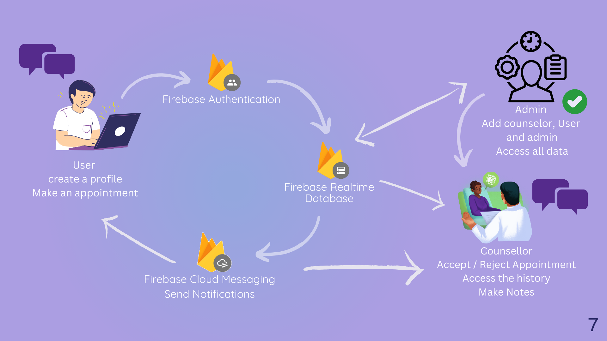

[comment]: # "This is the standard layout for the project, but you can clean this and use your template"

# Empowering Counselors and Students through Interactive Web and Mobile App

---

## Table of Contents
1. [Introduction](#introduction)
2. [Objectives](#objectives)
3. [Highlevel Solution Architecture](#high-level-solution-architecture)
4. [Software Design](#software-design)
5. [Key Features](#key-features)
6. [Why Bloomi](#why-bloomi)
7. [Getting Started](#getting-started)
8. [Contact](#contact)
9. [Team](#team)
10. [Links](#links)

---

## Introduction

Welcome to **BLOOMi**! *BLOOMi* is a comprehensive project focused on developing and deploying a mobile app and web app designed to empower counselors and students. The project aims to enhance the counseling process through an interactive digital platform. By leveraging the capabilities of these apps, counselors can effectively engage with students, providing guidance and support in a more dynamic and accessible manner. Simultaneously, students benefit from a user-friendly interface that facilitates communication, resource-sharing, and personalized assistance. Through its innovative approach, *Bloomi* fosters an environment conducive to improved counseling experiences and enriched student development.

## Objectives

The objective of BLOOMi is to provide accessible and personalized counseling services for university students, promoting their mental well-being and academic success. Through our user-friendly platform and strategic partnerships, we aim to enhance the student experience and empower them to thrive in their educational journey.

## High-level Solution Architecture

#### Utilizing Flutter and Firebase, involves the following components:

**Flutter Framework:** The front end of the mobile application is built using the Flutter framework, which allows for cross-platform development. Flutter provides a rich set of UI components and facilitates seamless integration with Firebase.

**Firebase Authentication:** Firebase Authentication is used for user authentication and login functionality. It provides secure authentication methods, including email/password, social media logins, and single sign-on options.

**Firebase Realtime Database:** Firebase Realtime Database is utilized to store and retrieve real-time data. It enables efficient data synchronization between the client-side app and the server, facilitating seamless communication between students and counselors.

**Firebase Cloud Firestore:** Firestore is a NoSQL document database provided by Firebase. It is used for storing structured data, such as user profiles, counselor information, appointment details, and chat messages. Firestore offers scalability, real-time updates, and offline support.

**Chat Functionality:** The chat feature is implemented using Firebase Cloud Firestore's real-time capabilities. It allows students and counselors to engage in real-time conversations, exchanging messages securely within the app.

**Push Notifications:** Firebase Cloud Messaging (FCM) is utilized to implement push notifications, enabling timely communication and updates for users. Students can receive notifications for appointment reminders, counselor responses, and important announcements.

## Software Design

### User Interface for Students

**User Profile:**
   students can view and edit their profile information, including name, profile picture, contact details, and academic information.
   
**Dashboard:**
   provides an overview of upcoming appointments, messages, and important notifications.

**Search and Connect:**
   feature to find counselors based on various criteria, such as specialization or availability, and a button to initiate connections or schedule appointments.

**Messaging System:**
  enables students to communicate securely and directly with their counselors, share documents or images, and receive notifications for new messages.

**Appointments and Scheduling:**
   allows students to book appointments with counselors, view upcoming sessions, and receive reminders.

**Resources and Content Library:**
   Access to a library of educational resources, articles, videos, and documents that can aid students in their academic and personal development.

**Notifications:**
  keep students informed about important updates, upcoming appointments, or new messages.

**Settings:**
   students can customize their app preferences, including notification settings, privacy controls, and profile details.

**Logout/Sign Out:**
    securely log out of the app when needed.

**Privacy and Security:**
    Clear information on how user data is handled and what security measures are in place to protect their privacy.
   
#image for user dashboard

### User Interface for Counselors

**Counselor Profile:**
    counselors can view and edit their profile information, including name, credentials, profile picture, contact details, and specialization.

**Dashboard:**
    provides an overview of upcoming counseling sessions, messages, and important notifications.

**Appointments and Calendar:**
   allows counselors to view upcoming sessions, manage their availability, and access detailed information about each session.

**Student Management:**
   search and manage students they are currently counseling, including access to student profiles and session history.

**Messaging System:**
   enables counselors to communicate securely and directly with students, share documents or resources, and receive notifications for new messages.

**Session Notes and Documentation:**
  take session notes, record progress, and access past session records for each student.

**Resources and Content Library:**
   library of educational resources, articles, videos, and documents that can be shared with students during counseling sessions.

**Appointment Scheduling:**
   availability of the counselors, accept or decline appointment requests, and manage their counseling schedule.

**Notifications:**
    keep counselors informed about upcoming appointments, new messages, and other important updates.

**Settings:**
    An area where counselors can customize their app preferences, including notification settings, privacy controls, and profile details.

**Privacy and Security:**
    Clear information on how user data is handled and what security measures are in place to protect counselor and student privacy.

**Analytics and Reports:**
    Tools to access reports and analytics related to counseling sessions, student progress, and app usage statistics.

#images for counselor ui

###  User Interface for Admin

**Dashboard:**
   provides an overview of key platform metrics, such as the number of active users, recent activities, and system health indicators.

**User Management:**
   manage user accounts, including the ability to view, create, edit, and deactivate counselor and student profiles.

**Feedback and Review Management:**
   review and manage feedback and reviews submitted by students and counselors to ensure quality control.

**Security and Privacy Controls:**
   manage user data security and privacy, including the ability to set and enforce privacy policies and data retention rules.

**Analytics and Reporting:**
   generating and viewing reports and analytics related to platform usage, counselor performance, and user feedback.

**User Role Management:**
   capability to create, edit, or delete user roles (e.g., admin, counselor, student) and assign permissions.

**System Settings:**
    ability to configure and customize platform settings, such as notification settings, email templates, and system messages.

**User Activity Logs:**
    - Access to logs of user activity on the platform for auditing and troubleshooting purposes.

**Communication Tools:**
    - Messaging and notification tools for sending important updates or alerts to users and counselors.
#image for admin interface

## Key Features

**Student's Interface:**

**User Profile:** Allow students to create and edit their profiles, including personal details and academic information.

**Search and Connect:** Enable students to search for counselors based on specialization and availability and initiate connections or schedule appointments.

**Messaging System:** Provide a secure and direct messaging platform for communication with counselors.

**Appointments and Scheduling:** Allow students to book counseling sessions, view upcoming appointments, and receive reminders.

**Resources and Content Library:** Offer a repository of educational resources and articles related to academics, careers, and personal development.

**Counselor's Interface:**

*Counselor Profile:* Allow counselors to create and manage their profiles, showcasing their qualifications, expertise, and availability.

**Appointment Management:** Provide tools for counselors to set their availability, accept or decline appointment requests, and manage their counseling schedule.

**Student Management:** Allow counselors to view and manage their students, access session records, and track progress.

**Messaging System:** Offer a secure and direct messaging platform for communication with students.

**Session Notes and Documentation:** Enable counselors to take session notes, record progress, and maintain session history.

**Resource Sharing:** Allow counselors to share resources and articles with students during sessions.

**Administrator's Interface:**

**User Management:** Tools for managing user accounts, including the ability to create, edit, and deactivate profiles.

**Content Management:** A content management system to moderate and organize platform content and resources.

**Analytics and Reporting:** Access to reports and analytics related to platform usage, counselor performance, and user feedback.

**Security and Privacy Controls:** Features to manage user data security and privacy, including setting and enforcing privacy policies and data retention rules.

**User Role Management:** The ability to create, edit, or delete user roles and assign permissions.

**System Settings:** The ability to configure and customize platform settings, including notification settings, email templates, and system messages.

## Why Bloomi 

**Convenience:** Allows students and counselors to connect and communicate without the need for physical presence. 

**Accessibility:** Students can access counseling services from the comfort of their own devices, whether it's a computer, tablet, or smartphone, making counseling more accessible to a broader audience.

**Scheduling Flexibility:** typically includes scheduling features that enable students to book counseling sessions at times that suit them, promoting flexibility and accessibility.

**Privacy and Confidentiality:** can provide secure and private communication channels for counseling, ensuring that students' sensitive information remains confidential.

**Resource Sharing:** includes libraries of resources and articles that counselors can share with students to support their academic and personal development.

**Efficient Communication:** Messaging and notification features enable real-time and asynchronous communication between students and counselors, allowing them to exchange information and resources efficiently.

**Session Documentation:** often includes features for taking session notes, recording progress, and maintaining session history, which can be beneficial for tracking student development and counseling effectiveness.

**Analytics and Reporting:** Administrators can access reports and analytics to gain insights into the effectiveness of counseling services, which can guide improvements and adjustments.

**Scale and Reach:** Software can support a broader reach, allowing universities to offer counseling services to a larger number of students, even beyond their physical locations.

**Efficiency and Productivity:** can streamline administrative tasks and communication, making it easier for counselors to manage their schedules and focus on counseling rather than administrative work.

**Customization:** can be tailored to meet the specific needs and objectives of university or counseling organizations, allowing for a personalized user experience.

**Security and Compliance:** designed with robust security features to protect sensitive user data and ensure compliance with privacy regulations.

**Quality Assurance:** Maintain and improve the quality of counseling services by facilitating feedback, reviews, and monitoring of counselor performance.

## Getting Started

Please follow the installation and usage instructions provided in the [Documentation](https://cepdnaclk.github.io/e19-co227-Empowering-Counselors-and-Students-through-Interactive-Web-and-Mobile-App/docs).

## contact 

Feel free to contact us for more details!

## Team
-  E/19/017 Amanda W. S. [email](mailto:e19017@eng.pdn.ac.lk)
-  E/19/087 Dissanayaka M.A.S.R. [email](mailto:e19087@eng.pdn.ac.lk)
-  E/19/260 Neranji W.K.G.A.G. [email](mailto:e19260@eng.pdn.ac.lk)
-  E/19/465 Dilshan R.M.S. [email](mailto:e19465@eng.pdn.ac.lk)

## Links

- [Project Repository](https://github.com/cepdnaclk/e19-co227-Empowering-Counselors-and-Students-through-Interactive-Web-and-Mobile-App)
- [Project Page](https://cepdnaclk.github.io/e19-co227-Empowering-Counselors-and-Students-through-Interactive-Web-and-Mobile-App/)
- [Department of Computer Engineering](http://www.ce.pdn.ac.lk/)
- [University of Peradeniya](https://eng.pdn.ac.lk/)

[//]: # (Please refer this to learn more about Markdown syntax)
[//]: # (https://github.com/adam-p/markdown-here/wiki/Markdown-Cheatsheet)
